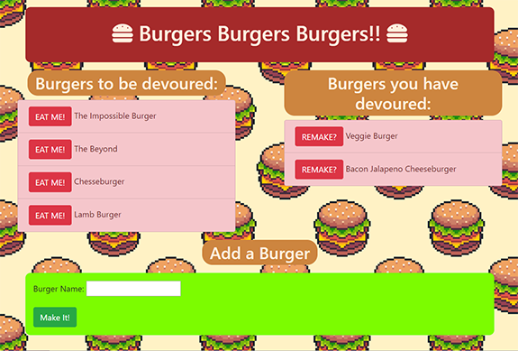

# Eat-Da-Burger!
> Create, eat and remake your favorite burgers.
## Deployed App
https://eat-da-burger-final.herokuapp.com/

## Table of contents
* [General info](#general-info)
* [Screenshots](#screenshots)
* [Technologies](#technologies)
* [Features](#features)
* [Status](#status)
* [Inspiration](#inspiration)
* [Contact](#contact)

## General info
This is a deployed app that lets users "Eat" burgers. When "eaten" the burger moves to the right column. You can move it back by "Remaking" it. You can also add a new burger.

## Screenshots
 

## Technologies
* MySQL
* JavaScript
* handlebars

## Code Examples
    router.post("/api/burgers", function(req, res) {
        burger.insertOne([
            "burger_name"
        ], [
            req.body.name
        ], function(result) {
            res.json({ id: result.insertId });
        });

## Features
List of features ready and TODOs for future development:
### Features
* Chose to eat a pre-filled burger.
* Chose to remake a burger you have already eaten.
* Create your own burger to eat.
### Design
* Colors based off burgers! Lettuce, tomato, burger and bun!
* Rounded corners make headings look like buns!

## Status
Project is: _finished_

## Inspiration
Inspired by burgers. Their color, shape and deliciousness!
Based on the burger assignment for The Coding Bootcamp at UT Austin.

## Contact
Created by Elise Hammons - feel free to contact me!
 [LinkedIn](https://www.linkedin.com/in/elise-h-01243258/)